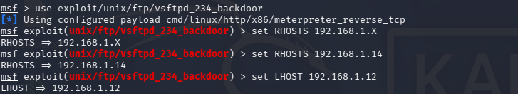
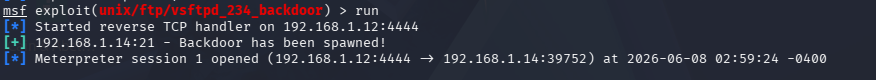

# VulnScan Lab — Penetration Testing Portfolio

Personal home lab built on VirtualBox. Each folder contains
a full pentest cycle — recon, exploitation, post-exploitation,
and a professional PDF report.

**Lab Setup**
- Attacker : Kali Linux — 192.168.1.12
- Targets  : Metasploitable 2, Windows VM, Windows Server
- Network  : Bridged LAN (isolated home network)

---

## Completed

| # | Vulnerability | CVE | Severity | Report |
|---|---|---|---|---|
| 1 | vsftpd 2.3.4 Backdoor | CVE-2011-2523 | Critical | [View](./01-vsftpd-backdoor/vsftpd_pentest_report.pdf) |

---

### 01 — vsftpd 2.3.4 Backdoor (CVE-2011-2523)

**Target:** Metasploitable 2 — 192.168.1.14
**Tool:** Metasploit Framework
**Result:** Root shell via Meterpreter

#### Host Discovery

#### Metasploit Configuration

#### Session Opened

#### Root Access Confirmed

---

## In Progress

| # | Vulnerability | Target |
|---|---|---|
| 2 | Samba usermap_script | Metasploitable 2 |
| 3 | EternalBlue MS17-010 | Windows VM |
| 4 | DVWA SQL Injection | Metasploitable 2 |