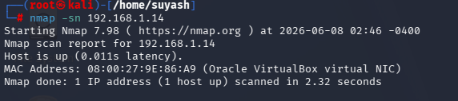
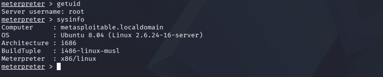
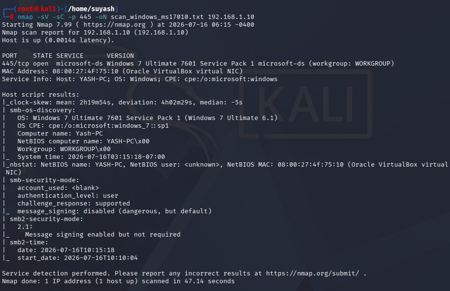
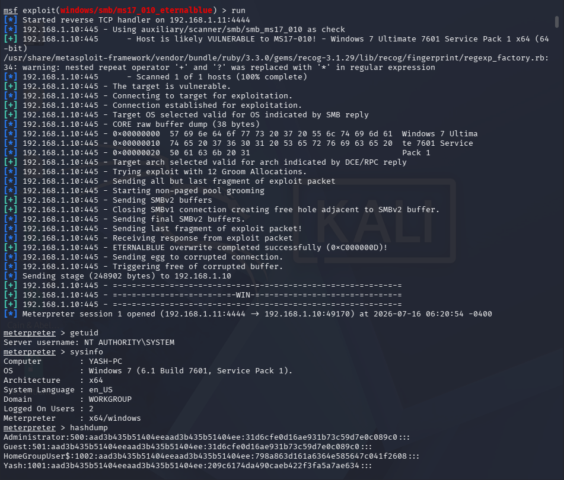
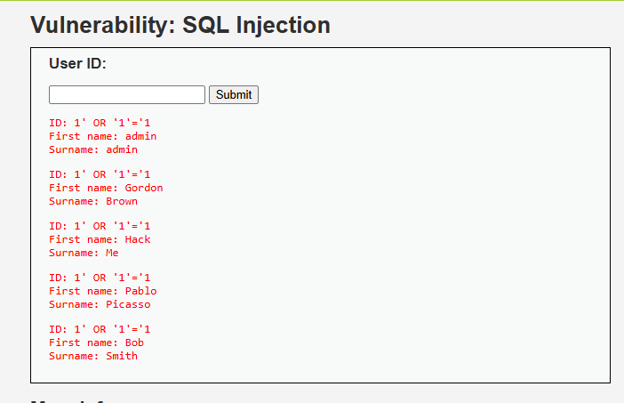
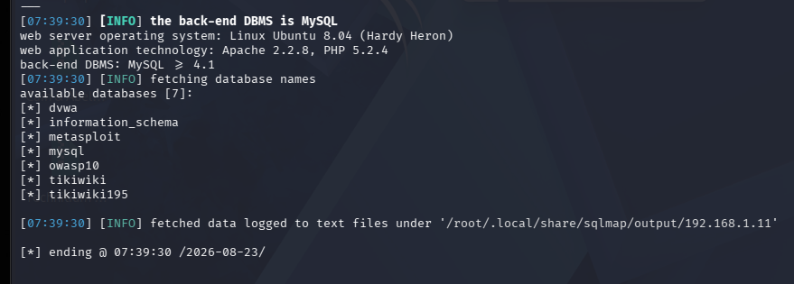

# VulnScan Lab — Penetration Testing Portfolio

Personal home lab built on VirtualBox. Each folder documents a complete
pentest cycle — recon, exploitation, post-exploitation, and a professional PDF report.

**Lab Setup**
- Attacker : Kali Linux
- Targets  : Metasploitable 2, Windows 7 SP1 VM
- Network  : Bridged LAN (isolated home network)
- Tools    : Nmap, Metasploit Framework, SQLMap, Burp Suite, Wireshark

---

## Completed

| # | Vulnerability | CVE / Ref | Severity | Target | Access Gained |
|---|---|---|---|---|---|
| 1 | vsftpd 2.3.4 Backdoor | CVE-2011-2523 | 🔴 Critical | Metasploitable 2 | root (Meterpreter) |
| 2 | Samba usermap_script | CVE-2007-2447 | 🔴 Critical | Metasploitable 2 | root (reverse shell) |
| 3 | EternalBlue MS17-010 | CVE-2017-0144 | 🔴 Critical | Windows 7 SP1 | NT AUTHORITY\SYSTEM |
| 4 | DVWA SQL Injection | OWASP A03:2021 | 🟠 High | Metasploitable 2 | Full DB — 7 databases |

---

### 01 — vsftpd 2.3.4 Backdoor (CVE-2011-2523)

**Service:** FTP — Port 21 | **Access:** root via Meterpreter

vsftpd 2.3.4 contained a malicious backdoor in its source tarball.
Sending a username with `:)` triggers a root shell on port 6200.

[→ Full writeup + PDF report](./01-vsftpd-backdoor/)

---

### 02 — Samba usermap_script (CVE-2007-2447)

**Service:** SMB — Ports 139/445 | **Access:** root via reverse shell

Samba 3.0.20 passes username input unsanitized to a shell during MS-RPC
authentication. Shell metacharacter injection gives unauthenticated root RCE.

[→ Full writeup + PDF report](./02-samba-usermap/)

---

### 03 — EternalBlue MS17-010 (CVE-2017-0144)

**Service:** SMB — Port 445 | **Access:** NT AUTHORITY\SYSTEM + hashdump

NSA-developed exploit targeting Windows SMBv1. Kernel buffer overflow delivers
Meterpreter as SYSTEM. All 4 Windows NTLM hashes retrieved via hashdump.

[→ Full writeup + PDF report](./03-eternalblue-ms17010/)

---

### 04 — DVWA SQL Injection (OWASP A03:2021)

**Service:** HTTP — Web Application | **Access:** Full MySQL server — 7 databases

User ID GET parameter concatenated directly into SQL without sanitization.
OR-based payload dumped all 5 users manually. SQLMap identified 4 injection
techniques and enumerated 7 databases including the MySQL root credentials DB.

[→ Full writeup + PDF report](./04-dvwa-sqli/)

---

## Skills Demonstrated

**Reconnaissance**
- Nmap host discovery, service fingerprinting (`-sV`, `-sC`, `-oN`)
- Nmap NSE scripting (`smb-vuln-ms17-010`)
- Manual web application input testing

**Exploitation**
- Metasploit Framework — module selection, payload config, session management
- Linux network service exploitation (FTP backdoor, SMB command injection)
- Windows SMBv1 kernel exploitation (EternalBlue, pool grooming)
- Web application SQL injection — manual and automated (SQLMap)

**Post-Exploitation**
- Linux: `whoami`, `id`, `uname -a`
- Windows: `getuid`, `sysinfo`, `hashdump`
- NTLM hash analysis and Pass-the-Hash concept
- MySQL database enumeration across 7 databases

**Documentation**
- Professional PDF pentest report for each exploit
- CVE research and OWASP category mapping
- Structured remediation recommendations per finding